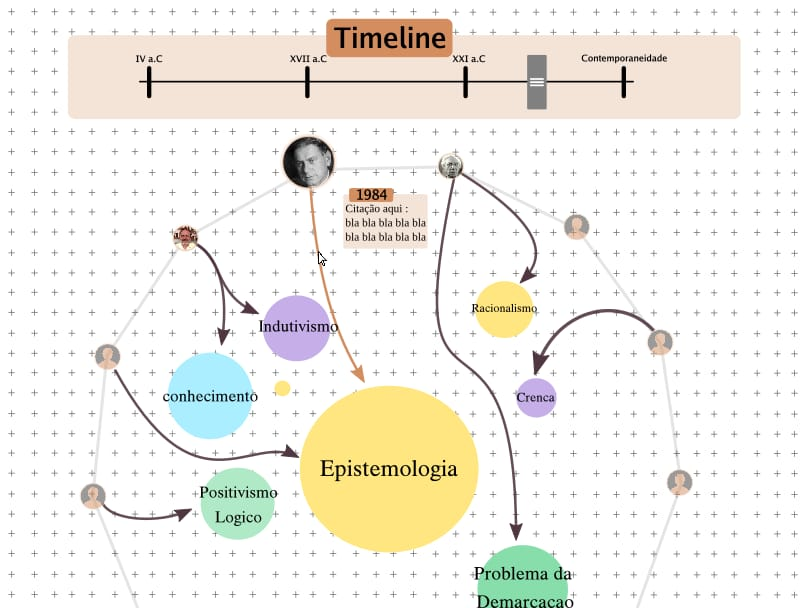

**Project: Philosophy of Science Visualizations**

This repository collects the plan and artifacts for the course final project. The goal is to produce visualizations of ideas and debates in the philosophy of science.

**Group Members**:

- **Group:** Arthur Farias Zaneti, Bruno Pereira de Paula, Gabriel Ferreira Silva, Igor Augusto Zwirtes, Pedro Pereira Carvalho

**Work Plan and Task Division**:

- Deliverables: 1) bibliographic dataset; 2) interactive prototype/mockup; 3) source code and short documentation; 4) final presentation.
- Example schedule:
	- Week 1: select bibliography and divide tasks.
	- Week 2: extract data and define attributes to represent.
	- Week 3: initial prototype (mockup and/or code sketch).
	- Week 4: implementation and refinement.
	- Week 5: documentation, testing, and presentation prep.
- Example responsibilities:
	- Text extraction and curation: Arthur Zaneti, Pedro Pereira, Bruno Pereira
	- Data modeling (metadata, relations): Igor Zwirtes, Gabriel Ferreira
	- Frontend / visualization: Artur Zaneti, Igor Zwirtes
	- Design and UX: Gabriel Ferreira, Igor Zwirtes
	- Integration and deployment: Bruno Pereira, Pedro Pereira

**Minimum Bibliography to Represent**:

- BACON, Francis. Novum organum e Nova Atlântida. São Paulo: Abril, 1973. 
- CHALMERS, Alan F. O que é ciência, afinal? São Paulo: Editora Brasiliense, 2017. 
- FEYERABEND, Paul. Contra o método. São Paulo: Editora da Unesp, 2011. 
- KUHN, Thomas S. The structure of scientific revolutions. Chicago: University of Chicago Press, 1962. 
- LAKATOS, Imre; MUSGRAVE, Alan (ORGS.). A crítica e o desenvolvimento do conhecimento. São Paulo: Editora da USP, 1979. 
- POPPER, Karl. The Logic of Scientific Discovery. London, Routledge, 2020a.

**Type of Visualization (proposed choice)**:
- Using a connected graph where connects onto the ideas they wrote or have a opinion about. Subject to change by a timeline that shows how the opinions differed through time.

**Visualization Sketch**:
- Mockup:

- Preliminary code (example):

**Inspiration Examples**:
- Deniz Cemon Duygu — philo gallery: https://www.denizcemonduygu.com/philo/
- Other visual references and repositories to consider (list links).

**Final Notes & Next Steps**:
- Fill this section with names and contact info.

